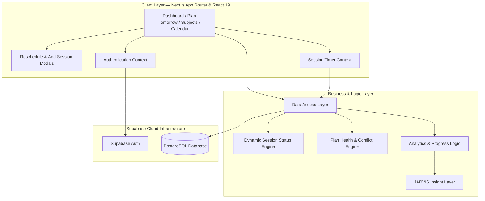
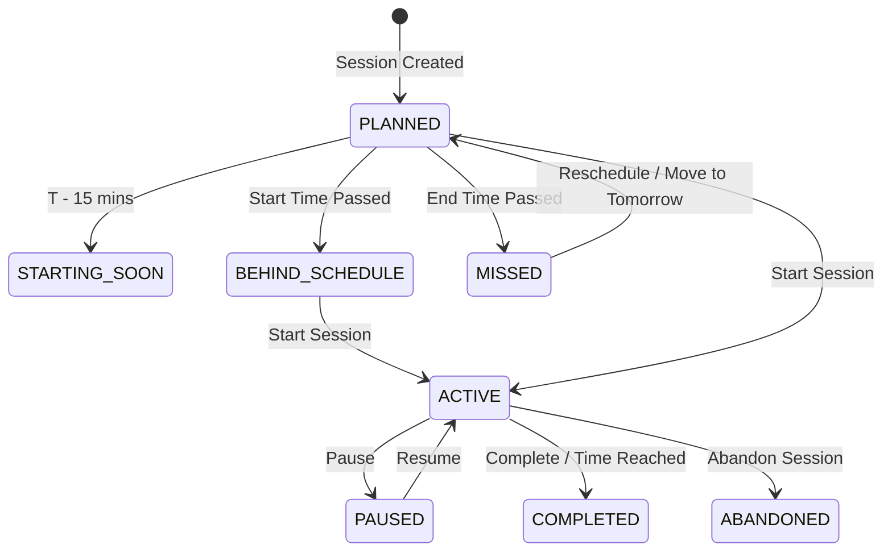
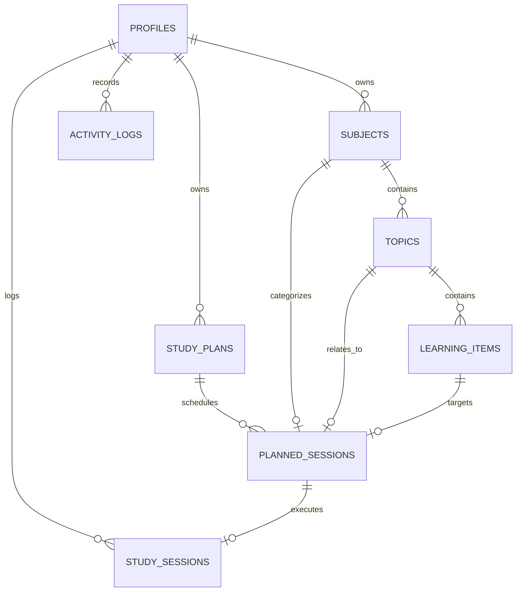

# StudyOS — Personal Study Management & Analytics System

<div align="center">


**A high-performance personal study management and analytics system built for focused learning, adaptive scheduling, real-time session tracking, and intelligent progress analysis.**

</div>

---

## 🌟 Overview

**StudyOS** is a personal study management and analytics workspace designed to turn study planning into an execution-driven workflow.

Instead of functioning as a simple to-do list, StudyOS connects:

**Planning → Execution → Tracking → Recovery → Analytics**

The system allows users to create structured learning goals, plan study sessions, execute those sessions using a persistent timer, recover missed sessions, monitor progress, and analyze study consistency over time.

Built with **Next.js 16, React 19, TypeScript, and Supabase**, StudyOS uses a layered architecture that separates UI, business logic, data access, authentication, and persistence.

---

## 🎯 Core Workflow

StudyOS follows a continuous study-management lifecycle:

```text
Create Subjects
      ↓
Organize Topics & Learning Items
      ↓
Plan Tomorrow
      ↓
Today's Mission
      ↓
Start Study Session
      ↓
Persistent Timer
      ↓
Complete / Pause / Abandon
      ↓
Progress & Activity Tracking
      ↓
Analytics & Insights
      ↓
Recover Missed Sessions
      ↓
Plan Again
```

This makes StudyOS an execution system rather than only a planning application.

---

# 🔥 Key Features

## 🎯 1. Today's Mission & Dynamic Schedule

Today's Mission acts as the user's primary execution view.

### Real-Time Session Tracking

* Monitors planned study sessions against the current system time.
* Determines the current state of every planned session dynamically.
* Highlights upcoming, active, delayed, completed, and missed sessions.

### Automated Overdue Detection

Sessions are automatically evaluated based on their scheduled start and end times.

Possible states include:

* `PLANNED`
* `STARTING_SOON`
* `BEHIND_SCHEDULE`
* `ACTIVE`
* `COMPLETED`
* `MISSED`
* `ABANDONED`

### Missed Session Recovery

Missed sessions are not treated as permanently lost work.

Users can:

* Move a session to tomorrow.
* Reschedule it for later today.
* Start it immediately.
* Choose a custom time slot.

### Custom Rescheduling

The rescheduling workflow supports presets such as:

* Tomorrow — Same Time
* Start Now
* Tonight
* Custom Time

This allows the schedule to adapt when the user's actual day does not go according to plan.

### On-the-Fly Planning

Users can add new sessions directly to today's mission when they did not create a plan in advance.

---

## 📅 2. Plan Tomorrow — Adaptive Scheduler

The Tomorrow Scheduler is used to prepare the next day's study plan.

### Schedule Builder

Users can:

* Select subjects.
* Select topics and learning items.
* Create study sessions.
* Define start and end times.
* Set planned study duration.
* Organize multiple sessions throughout the day.

### Plan Health Engine

Before finalizing a plan, StudyOS evaluates its quality.

The planner can identify:

* `BALANCED`
* `UNDERPLANNED`
* `OVERLOADED`
* `CONFLICT`

It considers factors such as:

* Total study duration.
* Available time.
* Break periods.
* Overlapping sessions.
* Scheduling conflicts.

### Auto-Save & Plan Commit

Draft schedule changes can be synchronized with Supabase.

Once finalized, a plan can be locked to represent the committed schedule for that day.

---

## ⏱️ 3. Persistent Real-Time Study Timer

StudyOS includes a persistent study timer designed for actual execution rather than simple countdown functionality.

The timer is designed to remain consistent across:

* Page reloads.
* Tab switching.
* Browser sleep.
* Navigation between application views.

### Session States

Study sessions support:

```text
ACTIVE
  ↓
PAUSED
  ↓
ACTIVE
  ↓
COMPLETED
```

A session can also become:

```text
ABANDONED
```

### Tracking

StudyOS records information such as:

* Planned duration.
* Start time.
* End time.
* Pause duration.
* Actual study duration.
* Session status.

This creates a difference between **planned study time** and **actual execution time**.

---

## 📚 4. Subject → Topic → Learning Item Hierarchy

StudyOS organizes learning using a hierarchical structure:

```text
Subject
   └── Topic
        └── Learning Item
```

### Subject

Represents a major academic area such as:

```text
Data Structures & Algorithms
Database Management Systems
Computer Networks
Operating Systems
```

### Topic

Represents a specific area within a subject.

### Learning Item

Represents the smallest trackable unit of learning.

This structure allows StudyOS to provide granular progress tracking rather than only showing subject-level completion.

---

## 📊 5. Progress & Analytics

StudyOS records study activity and converts it into meaningful progress information.

Analytics can include:

* Planned study time.
* Actual study time.
* Study-session completion.
* Subject progress.
* Learning-item completion.
* Study consistency.
* Target adherence.
* Recent study activity.
* Streak information.

### Seven-Day Analytics

StudyOS provides recent study breakdowns using **Recharts** to visualize study activity over the previous seven days.

---

## 🤖 6. JARVIS Intelligence

StudyOS includes a JARVIS-style intelligence layer designed to provide contextual study insights.

The intelligence layer can surface information such as:

* Current study velocity.
* Target adherence.
* Study streaks.
* Session progress.
* Current execution status.
* Recent study patterns.

The purpose of JARVIS is to transform raw study data into concise, actionable feedback rather than simply displaying statistics.

---

## 📈 7. Planned vs Actual Study Tracking

One of the core ideas behind StudyOS is distinguishing between:

```text
What was planned?
        ↓
What actually happened?
```

For every study session, the system can compare:

| Metric       | Meaning                                |
| ------------ | -------------------------------------- |
| Planned Time | Intended study duration                |
| Actual Time  | Time actually spent studying           |
| Status       | Completed, missed, abandoned, etc.     |
| Adherence    | How closely execution matched the plan |

This makes the system useful for measuring **study discipline and consistency**, not just task completion.

---

# 🏗️ System Architecture

StudyOS follows a layered architecture separating presentation, application logic, data access, and backend infrastructure.



---

# 🔄 Session Lifecycle & State Machine

StudyOS dynamically manages the lifecycle of planned and active sessions.



This state-driven approach allows the UI to reflect the actual state of a study session without requiring every state to be manually entered by the user.

---

# 🗓️ Planning vs Execution Model

StudyOS separates **planning** from **execution**.

```text
                 PLANNING
                    │
                    ▼
            Tomorrow Scheduler
                    │
                    ▼
             Study Plan
                    │
                    ▼
          Planned Sessions
                    │
                    ▼
                 EXECUTION
                    │
                    ▼
             Today's Mission
                    │
                    ▼
             Active Session
                    │
                    ▼
              Study Timer
                    │
                    ▼
              Actual Data
                    │
                    ▼
                ANALYTICS
```

This separation makes it possible to measure whether the user's actual behavior matches the plan.

---

# 🗄️ Database Entity Relationship Diagram



---

# 📂 Directory Layout

```text
studytracker/
│
├── src/
│   ├── app/
│   │   ├── api/                    # API routes
│   │   ├── plan-tomorrow/          # Tomorrow Scheduler
│   │   ├── subjects/               # Subject management
│   │   ├── globals.css             # Design system CSS
│   │   ├── layout.tsx              # Root layout & providers
│   │   └── page.tsx                # Dashboard
│   │
│   ├── components/
│   │   ├── dashboard/              # Dashboard components
│   │   ├── layout/                 # Header & Sidebar
│   │   ├── planner/                # Scheduler components
│   │   ├── subjects/               # Subject components
│   │   └── ui/                     # UI primitives
│   │
│   ├── context/
│   │   ├── AuthContext.tsx         # Authentication context
│   │   └── TimerContext.tsx        # Persistent timer context
│   │
│   ├── lib/
│   │   ├── data-access/            # Data abstraction layer
│   │   │   ├── dashboard.ts
│   │   │   ├── planner.ts
│   │   │   ├── timer.ts
│   │   │   └── subjects.ts
│   │   │
│   │   ├── supabase/               # Supabase client & DB types
│   │   └── planner-utils.ts        # Planning & health utilities
│   │
│   └── types/
│       ├── dashboard.ts
│       ├── planner.ts
│       └── subjects.ts
│
├── public/                         # Static assets
├── package.json
└── tsconfig.json
```

---

# ⚡ Tech Stack

| Component          | Technology                    | Purpose                             |
| ------------------ | ----------------------------- | ----------------------------------- |
| **Framework**      | Next.js 16.3                  | Application framework & App Router  |
| **UI Library**     | React 19.2                    | User interface                      |
| **Language**       | TypeScript 5                  | Type-safe development               |
| **Database**       | Supabase PostgreSQL           | Persistent application data         |
| **Authentication** | Supabase Auth                 | User authentication                 |
| **Styling**        | Tailwind CSS v4 + Vanilla CSS | Application styling                 |
| **Icons**          | Lucide React                  | Interface icons                     |
| **Charts**         | Recharts                      | Analytics visualization             |
| **Architecture**   | Next.js App Router            | Client/server application structure |

---

# 🚀 Getting Started

## Prerequisites

Make sure the following are installed:

* **Node.js:** v20.x or higher
* **npm**, **yarn**, or **pnpm**
* A **Supabase** project

---

## 1. Clone the Repository

```bash
git clone https://github.com/Maxwell343/StudyOS-Personal-Study-Management-Analytics-System.git
```

Navigate into the project:

```bash
cd StudyOS-Personal-Study-Management-Analytics-System
```

---

## 2. Install Dependencies

```bash
npm install
```

---

## 3. Configure Environment Variables

Create a `.env.local` file in the project root:

```env
NEXT_PUBLIC_SUPABASE_URL=https://your-supabase-project-url.supabase.co
NEXT_PUBLIC_SUPABASE_ANON_KEY=your-supabase-anon-key
```

Replace the placeholder values with the credentials from your Supabase project.

---

## 4. Configure the Database

Execute the required SQL schema in the **Supabase SQL Editor**.

The database structure is described in the Database Schema section below.

---

## 5. Start the Development Server

```bash
npm run dev
```

The application will be available at:

```text
http://localhost:3000
```

---

# 📜 Database Schema

StudyOS uses PostgreSQL through Supabase.

## Enums

```sql
CREATE TYPE learning_item_status AS ENUM (
    'NOT_STARTED',
    'IN_PROGRESS',
    'COMPLETED'
);

CREATE TYPE learning_item_priority AS ENUM (
    'LOW',
    'MEDIUM',
    'HIGH'
);

CREATE TYPE study_plan_status AS ENUM (
    'DRAFT',
    'LOCKED',
    'COMPLETED'
);

CREATE TYPE planned_session_status AS ENUM (
    'PLANNED',
    'ACTIVE',
    'COMPLETED',
    'MISSED',
    'CANCELLED'
);

CREATE TYPE study_session_status AS ENUM (
    'ACTIVE',
    'PAUSED',
    'COMPLETED',
    'ABANDONED'
);
```

## Core Entities

The database contains the following primary entities:

```text
PROFILES
   │
   ├── SUBJECTS
   │      └── TOPICS
   │             └── LEARNING_ITEMS
   │
   ├── STUDY_PLANS
   │      └── PLANNED_SESSIONS
   │
   ├── STUDY_SESSIONS
   │
   └── ACTIVITY_LOGS
```

### Profiles

Stores user profile information.

### Subjects

Represents major areas of study.

### Topics

Organizes subjects into smaller learning areas.

### Learning Items

Represents individual trackable learning units.

### Study Plans

Stores daily study plans.

### Planned Sessions

Stores scheduled study sessions including:

* Subject
* Topic
* Learning item
* Start time
* End time
* Planned duration
* Status

### Study Sessions

Stores actual execution information including:

* Start time
* End time
* Pause duration
* Actual duration
* Session status

### Activity Logs

Stores study-related activity and associated metadata.

---

# 🧠 Data Model

The system distinguishes between a **planned session** and an **executed study session**.

```text
PLANNED_SESSION
      │
      │ User starts session
      ▼
STUDY_SESSION
      │
      ├── started_at
      ├── ended_at
      ├── total_paused_seconds
      ├── actual_minutes
      └── status
```

This enables StudyOS to compare planned study time with actual study execution.

---

# 📊 Analytics Philosophy

StudyOS focuses on measuring **behavior**, not just task completion.

The system can answer questions such as:

* How much study time was planned?
* How much time was actually completed?
* Which subjects are receiving the most attention?
* Which planned sessions were missed?
* How consistently is the user following their schedule?
* How is study activity changing over the last seven days?
* What should the user focus on next?

The goal is to provide an execution-oriented view of personal learning.

---

# 🛠️ Verification & Production Build

Before committing or deploying changes, verify the project using:

### TypeScript Check

```bash
npx tsc --noEmit
```

### Production Build

```bash
npm run build
```

A successful TypeScript check and production build indicate that the application is structurally ready for deployment.

---

# 🔐 Environment & Security

Environment-specific credentials should **never be committed to GitHub**.

Keep secrets inside:

```text
.env.local
```

The repository should contain only public configuration placeholders.

Never commit:

```text
.env.local
.env
```

if they contain real Supabase credentials or other secrets.

---

# 🚧 Future Development

Potential future improvements include:

* More intelligent study recommendations.
* Expanded JARVIS capabilities.
* Automated session reminders.
* More detailed historical analytics.
* Adaptive scheduling based on previous execution.
* Advanced study consistency insights.
* Voice-based JARVIS interactions.
* More personalized learning recommendations.

---

# 📄 License

Distributed under the **MIT License**.

See `LICENSE` for more information.

---

<div align="center">

**StudyOS**

*Plan better. Focus deeper. Learn consistently.*

</div>