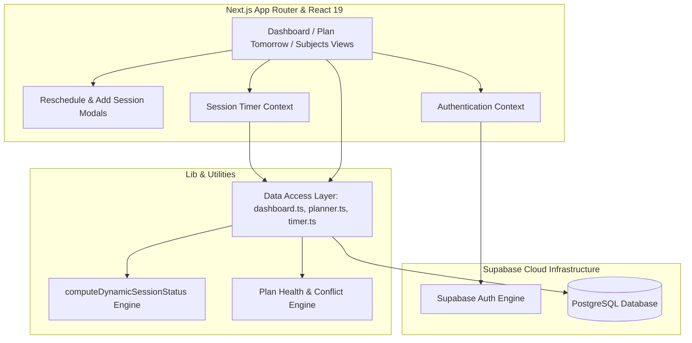
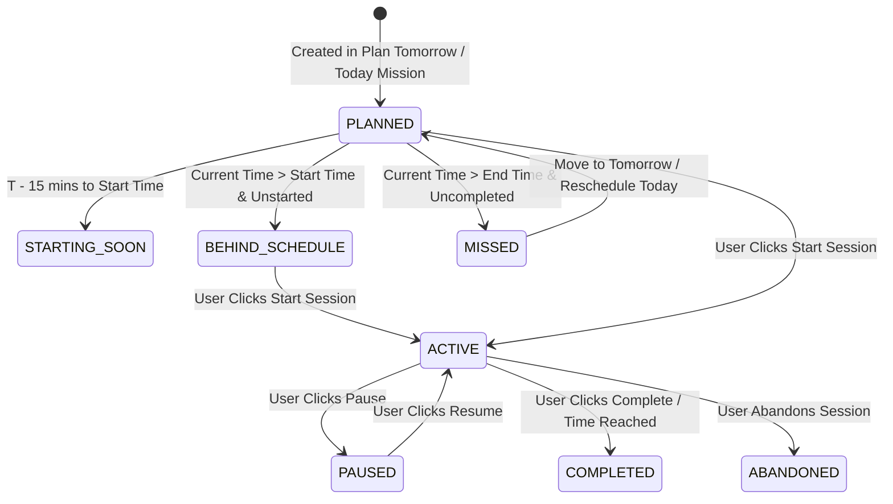

# StudyOS — Personal Study Management & Analytics System

<div align="center">


**A high-performance, intelligent personal study management and real-time analytics system designed for focused learning, adaptive scheduling, and automated progress tracking.**

</div>

---

## 🌟 Overview

**StudyOS** is a comprehensive developer-focused study planner and analytics workspace. Built on Next.js 16 (App Router), React 19, and Supabase, it empowers users to structure their learning, track deep work sessions with high temporal precision, dynamically manage missed/overdue time slots, and visualize productivity trends.

---

## 🔥 Key Features

### 🎯 1. Today's Mission & Dynamic Schedule
- **Real-Time Session Tracking**: Monitors planned study slots against current system time.
- **Automated Overdue Detection**: Automatically flags uncompleted sessions past their end time as `MISSED` or `BEHIND SCHEDULE`.
- **Missed Session Recovery**:
  - 1-click **Move to Tomorrow** (transfers planned sessions to tomorrow's schedule and recalculates target minutes).
  - 1-click **Reschedule Today** (adjusts time slot for later today or immediate focus).
  - **Custom Reschedule Modal**: Provides presets (*Tomorrow Same Time*, *Start Now*, *Tonight 22:00–23:00*) and custom time inputs.
- **On-the-Fly Today Planning**: Allows users who forgot to plan yesterday to add new sessions directly to today's mission.

### 📅 2. Plan Tomorrow (Tomorrow Scheduler)
- Dedicated interactive planner for setting up next day's missions.
- **Plan Health Engine**: Evaluates schedule balance (`balanced`, `underplanned`, `overloaded`, `conflict`), total study duration, break times, and overlapping session conflicts.
- **Auto-Save & Plan Commit**: Automatically syncs draft changes to Supabase and locks finalized plans.

### ⏱️ 3. Persistent Real-Time Timer
- High-precision timer surviving page reloads, tab switching, and browser sleep.
- Supports `ACTIVE`, `PAUSED`, `COMPLETED`, and `ABANDONED` session states with automated activity logging.
- Overtime indicator and target completion notifications.

### 📚 4. Subject Taxonomy & Progress Hierarchy
- Multi-tier subject organization: **Subject → Topic → Learning Item**.
- Granular completion tracking with dynamic subject progress indicators.

### 🤖 5. JARVIS Intelligence & Analytics
- Context-aware insight bar summarizing current study velocity, target adherence, and streak metrics.
- Last 7-day study breakdown charts built with Recharts.

---

## 🏗️ System Architecture

StudyOS follows a layered, decoupled architecture ensuring clean separation of concerns, robust data integrity, and real-time responsiveness.



---

## 🔄 Session Lifecycle & Status State Machine



---

## 🗄️ Database Entity Relationship Diagram (ERD)

```mermaid
erDiagram
    PROFILES ||--o{ SUBJECTS : "owns"
    PROFILES ||--o{ STUDY_PLANS : "owns"
    PROFILES ||--o{ STUDY_SESSIONS : "logs"
    PROFILES ||--o{ ACTIVITY_LOGS : "records"

    SUBJECTS ||--o{ TOPICS : "contains"
    TOPICS ||--o{ LEARNING_ITEMS : "contains"

    STUDY_PLANS ||--o{ PLANNED_SESSIONS : "schedules"
    
    SUBJECTS ||--o? PLANNED_SESSIONS : "categorizes"
    TOPICS ||--o? PLANNED_SESSIONS : "relates to"
    LEARNING_ITEMS ||--o? PLANNED_SESSIONS : "targets"
    PLANNED_SESSIONS ||--o? STUDY_SESSIONS : "executes"
```

---

## 📂 Directory Layout

```
studytracker/
├── src/
│   ├── app/
│   │   ├── api/             # API routes
│   │   ├── plan-tomorrow/   # Plan Tomorrow page
│   │   ├── subjects/        # Subjects management page
│   │   ├── globals.css      # Design System CSS tokens
│   │   ├── layout.tsx       # Root layout & providers
│   │   └── page.tsx         # Dashboard main page
│   ├── components/
│   │   ├── dashboard/       # Dashboard components (MissionList, HeroNextSession, RescheduleSessionModal, etc.)
│   │   ├── layout/          # Header, Sidebar navigation
│   │   ├── planner/         # Plan Tomorrow components (ScheduleBuilder, AddSessionDialog, PlanHealth)
│   │   ├── subjects/        # Subject detail & management components
│   │   └── ui/              # Base UI primitives
│   ├── context/
│   │   ├── AuthContext.tsx  # User auth context
│   │   └── TimerContext.tsx # Persistent study timer context
│   ├── lib/
│   │   ├── data-access/     # Data abstraction layer (dashboard.ts, planner.ts, timer.ts, subjects.ts)
│   │   ├── supabase/        # Supabase client & generated database types
│   │   └── planner-utils.ts # Utility functions & health computation
│   └── types/               # TypeScript interfaces (dashboard.ts, planner.ts, subjects.ts)
├── public/                  # Static assets
├── package.json
└── tsconfig.json
```

---

## ⚡ Tech Stack

| Component | Technology | Description |
| :--- | :--- | :--- |
| **Framework** | Next.js 16.3 (App Router) | Server & Client Rendered React Architecture |
| **UI Library** | React 19.2 | Concurrent UI Rendering |
| **Language** | TypeScript 5 | End-to-End Type Safety |
| **Database & Auth** | Supabase | Managed PostgreSQL, Row Level Security, Auth |
| **Styling** | Tailwind CSS v4 + Vanilla CSS | Modern Glassmorphic Dark UI |
| **Icons & Charts** | Lucide React + Recharts | Responsive Icons & Data Visualizations |

---

## 🚀 Getting Started

### Prerequisites
- **Node.js**: `v20.x` or higher
- **npm** / **yarn** / **pnpm**
- A **Supabase** project instance

### 1. Clone & Install Dependencies
```bash
git clone https://github.com/Maxwell343/StudyOS-Personal-Study-Management-Analytics-System.git
cd StudyOS-Personal-Study-Management-Analytics-System
npm install
```

### 2. Configure Environment Variables
Create a `.env.local` file in the root directory:
```env
NEXT_PUBLIC_SUPABASE_URL=https://your-supabase-project-url.supabase.co
NEXT_PUBLIC_SUPABASE_ANON_KEY=your-supabase-anon-key
```

### 3. Run Database Migrations
Execute the SQL schema definitions in your Supabase SQL Editor (see Database Schema below).

### 4. Start Development Server
```bash
npm run dev
```
Open [http://localhost:3000](http://localhost:3000) in your browser.

---

## 📜 Database Schema (Supabase SQL)

```sql
-- Create Enums
CREATE TYPE learning_item_status AS ENUM ('NOT_STARTED', 'IN_PROGRESS', 'COMPLETED');
CREATE TYPE learning_item_priority AS ENUM ('LOW', 'MEDIUM', 'HIGH');
CREATE TYPE study_plan_status AS ENUM ('DRAFT', 'LOCKED', 'COMPLETED');
CREATE TYPE planned_session_status AS ENUM ('PLANNED', 'ACTIVE', 'COMPLETED', 'MISSED', 'CANCELLED');
CREATE TYPE study_session_status AS ENUM ('ACTIVE', 'PAUSED', 'COMPLETED', 'ABANDONED');

-- Create Tables
CREATE TABLE profiles (
  id UUID PRIMARY KEY REFERENCES auth.users(id) ON DELETE CASCADE,
  name TEXT,
  avatar_url TEXT,
  created_at TIMESTAMPTZ DEFAULT NOW(),
  updated_at TIMESTAMPTZ DEFAULT NOW()
);

CREATE TABLE subjects (
  id UUID PRIMARY KEY DEFAULT gen_random_uuid(),
  user_id UUID NOT NULL REFERENCES auth.users(id) ON DELETE CASCADE,
  name TEXT NOT NULL,
  description TEXT,
  category TEXT DEFAULT 'General',
  color TEXT DEFAULT '#22d3ee',
  target_date DATE,
  archived BOOLEAN DEFAULT FALSE,
  dbms_seeded BOOLEAN DEFAULT FALSE,
  created_at TIMESTAMPTZ DEFAULT NOW(),
  updated_at TIMESTAMPTZ DEFAULT NOW()
);

CREATE TABLE topics (
  id UUID PRIMARY KEY DEFAULT gen_random_uuid(),
  subject_id UUID NOT NULL REFERENCES subjects(id) ON DELETE CASCADE,
  name TEXT NOT NULL,
  description TEXT,
  display_order INT DEFAULT 0,
  created_at TIMESTAMPTZ DEFAULT NOW(),
  updated_at TIMESTAMPTZ DEFAULT NOW()
);

CREATE TABLE learning_items (
  id UUID PRIMARY KEY DEFAULT gen_random_uuid(),
  topic_id UUID NOT NULL REFERENCES topics(id) ON DELETE CASCADE,
  title TEXT NOT NULL,
  description TEXT,
  status learning_item_status DEFAULT 'NOT_STARTED',
  priority learning_item_priority DEFAULT 'MEDIUM',
  estimated_minutes INT DEFAULT 30,
  completed_at TIMESTAMPTZ,
  last_studied_at TIMESTAMPTZ,
  created_at TIMESTAMPTZ DEFAULT NOW(),
  updated_at TIMESTAMPTZ DEFAULT NOW()
);

CREATE TABLE study_plans (
  id UUID PRIMARY KEY DEFAULT gen_random_uuid(),
  user_id UUID NOT NULL REFERENCES auth.users(id) ON DELETE CASCADE,
  plan_date DATE NOT NULL,
  target_minutes INT DEFAULT 0,
  status study_plan_status DEFAULT 'DRAFT',
  locked_at TIMESTAMPTZ,
  created_at TIMESTAMPTZ DEFAULT NOW(),
  updated_at TIMESTAMPTZ DEFAULT NOW(),
  UNIQUE(user_id, plan_date)
);

CREATE TABLE planned_sessions (
  id UUID PRIMARY KEY DEFAULT gen_random_uuid(),
  study_plan_id UUID NOT NULL REFERENCES study_plans(id) ON DELETE CASCADE,
  user_id UUID NOT NULL REFERENCES auth.users(id) ON DELETE CASCADE,
  subject_id UUID REFERENCES subjects(id) ON DELETE SET NULL,
  topic_id UUID REFERENCES topics(id) ON DELETE SET NULL,
  learning_item_id UUID REFERENCES learning_items(id) ON DELETE SET NULL,
  title TEXT NOT NULL,
  start_time TIME NOT NULL,
  end_time TIME NOT NULL,
  planned_minutes INT NOT NULL,
  status planned_session_status DEFAULT 'PLANNED',
  created_at TIMESTAMPTZ DEFAULT NOW(),
  updated_at TIMESTAMPTZ DEFAULT NOW()
);

CREATE TABLE study_sessions (
  id UUID PRIMARY KEY DEFAULT gen_random_uuid(),
  user_id UUID NOT NULL REFERENCES auth.users(id) ON DELETE CASCADE,
  planned_session_id UUID REFERENCES planned_sessions(id) ON DELETE SET NULL,
  learning_item_id UUID REFERENCES learning_items(id) ON DELETE SET NULL,
  planned_minutes INT NOT NULL DEFAULT 60,
  started_at TIMESTAMPTZ NOT NULL,
  ended_at TIMESTAMPTZ,
  paused_at TIMESTAMPTZ,
  total_paused_seconds INT DEFAULT 0,
  actual_minutes INT,
  status study_session_status DEFAULT 'ACTIVE',
  created_at TIMESTAMPTZ DEFAULT NOW(),
  updated_at TIMESTAMPTZ DEFAULT NOW()
);

CREATE TABLE activity_logs (
  id UUID PRIMARY KEY DEFAULT gen_random_uuid(),
  user_id UUID NOT NULL REFERENCES auth.users(id) ON DELETE CASCADE,
  type TEXT NOT NULL,
  learning_item_id UUID REFERENCES learning_items(id) ON DELETE SET NULL,
  metadata JSONB,
  created_at TIMESTAMPTZ DEFAULT NOW()
);
```

---

## 🛠️ Verification & Building

To verify TypeScript types and build production assets:

```bash
# Run TypeScript compilation check
npx tsc --noEmit

# Build production Next.js bundle
npm run build
```

---

## 📄 License

Distributed under the MIT License. See `LICENSE` for more details.
