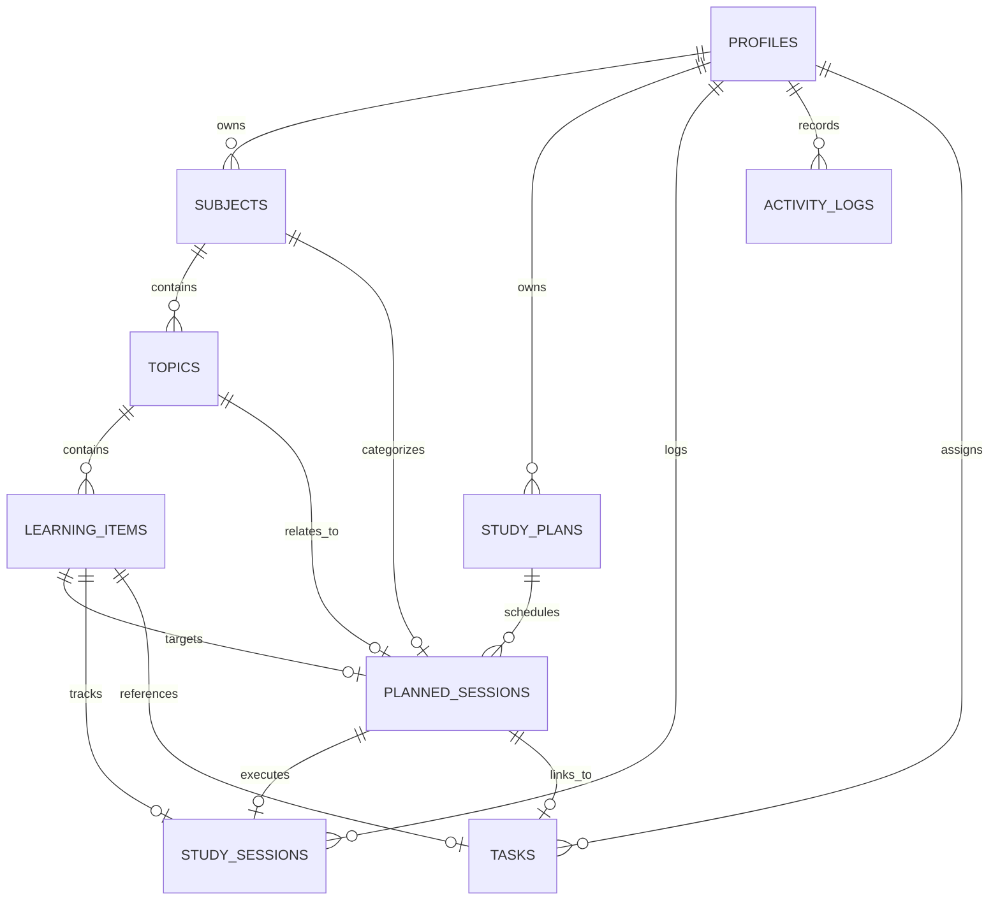

# StudyOS — Personal Study Management & Analytics System

<div align="center">


**A high-performance personal study management and analytics system built for focused learning, adaptive scheduling, real-time session tracking, goal progression, and intelligent JARVIS study analytics.**

</div>

---

## 🌟 Overview

**StudyOS** is an intelligent personal study operating system designed to turn study planning into an execution-driven workflow.

Instead of functioning as a simple to-do list, StudyOS connects every phase of learning:

$$\textbf{Long/Short-Term Goals} \longrightarrow \textbf{Curriculum & Subjects} \longrightarrow \textbf{Adaptive Planning} \longrightarrow \textbf{Execution \& Real-Time Timer} \longrightarrow \textbf{Recovery} \longrightarrow \textbf{JARVIS Intelligence \& Deep Analytics}$$

The system enables students, engineers, and self-directed learners to structure complex curricula, plan balanced daily study missions, execute sessions with a resilient persistent timer, recover missed sessions dynamically, manage actionable goals and tasks, and gain deep behavioral insights through the built-in **JARVIS Intelligence Engine**.

Built on **Next.js 16.3 (App Router), React 19, TypeScript 5, Tailwind CSS v4, and Supabase (PostgreSQL + Auth)**, StudyOS utilizes a layered architecture that strictly separates UI, business logic, data access abstractions, recommendation engines, and persistent cloud storage.

---

## 🎯 Core Workflow

StudyOS follows a continuous, closed-loop study-management lifecycle:

```text
       ┌───────────────────────────────────────────────────────────┐
       │             1. DEFINE CURRICULA & GOALS                   │
       │  • Subjects, Topics & Granular Learning Items             │
       │  • Long-Term Milestones & Short-Term Sprint Targets       │
       └─────────────────────────────┬─────────────────────────────┘
                                     │
                                     ▼
       ┌───────────────────────────────────────────────────────────┐
       │             2. ADAPTIVE SCHEDULING (PLAN TOMORROW)        │
       │  • Smart Recommendation Engine (Priority + Decay + Urgency)│
       │  • Plan Health Engine (Overload, Conflicts, Balance)      │
       └─────────────────────────────┬─────────────────────────────┘
                                     │
                                     ▼
       ┌───────────────────────────────────────────────────────────┐
       │             3. TODAY'S MISSION & EXECUTION                │
       │  • Real-Time Session Status Evaluator                     │
       │  • Persistent Session Timer (Tab/Reload/Sleep Resilient)  │
       │  • Dynamic Overdue & Missed Session Recovery              │
       └─────────────────────────────┬─────────────────────────────┘
                                     │
                                     ▼
       ┌───────────────────────────────────────────────────────────┐
       │             4. TRACKING, TASKS & CALENDAR                 │
       │  • Interactive Month Grid with Intensity Indicators       │
       │  • Actionable Task Checklists with Priority Scoring       │
       │  • Day-by-Day Drill-Down Session Records                  │
       └─────────────────────────────┬─────────────────────────────┘
                                     │
                                     ▼
       ┌───────────────────────────────────────────────────────────┐
       │             5. JARVIS INTELLIGENCE & DEEP ANALYTICS       │
       │  • Executive Briefings & Priority Matrix (Eisenhower)     │
       │  • Planned vs Actual Adherence & Velocity Trends          │
       │  • GitHub-Style Study Heatmap & Subject Radar             │
       └───────────────────────────────────────────────────────────┘
```

---

# 🔥 Key Modules & Features

## 🎯 1. Today's Mission & Real-Time Dashboard (`/`)

Today's Mission acts as the user's primary tactical cockpit for daily execution.

* **Real-Time Dynamic Status Engine**: Evaluates every planned session against current wall-clock time, dynamically calculating session states (`PLANNED`, `STARTING_SOON`, `BEHIND_SCHEDULE`, `ACTIVE`, `COMPLETED`, `MISSED`, `ABANDONED`).
* **Active Focus Hero**: Highlights current or immediately upcoming sessions with direct actions to start, pause, resume, or finish.
* **Instant Overdue Recovery**: Detects missed or delayed sessions with one-click rescheduling presets:
  * *Tomorrow — Same Time*
  * *Start Now*
  * *Tonight Slot*
  * *Custom Time Slot*
* **On-the-Fly Session Creation**: Allows spontaneous study sessions to be added and tracked seamlessly within today's mission.
* **Daily Metrics & Progress Cards**: At-a-glance visualization of completed minutes, planned minutes, remaining focus blocks, and active streaks.

---

## 📅 2. Plan Tomorrow — Adaptive Scheduler (`/plan-tomorrow`)

A dedicated daily planning studio to craft balanced, conflict-free schedules for upcoming days.

* **Smart Schedule Builder**: Select subjects, topics, and specific learning items, setting exact time slots and planned durations.
* **Automated Recommendation Engine**: Recommends what to study next based on priority weighting, overdue items, memory decay curves, and past velocity.
* **Plan Health Engine**: Evaluates schedule feasibility in real-time, warning against:
  * `BALANCED`: Sustainable study pacing with proper breaks.
  * `UNDERPLANNED`: Below daily target hours.
  * `OVERLOADED`: Unrealistic study load exceeding healthy focus thresholds.
  * `CONFLICT`: Overlapping session time intervals.
* **Auto-Save & Schedule Commit**: Draft schedules save automatically; committing locks the plan to serve as the baseline for adherence analytics.

---

## ⏱️ 3. Persistent Real-Time Study Timer

A bulletproof study timer built for genuine focus sessions, engineered into global React Context.

* **State Persistence**: Survives page reloads, tab switches, browser sleep, and cross-route navigation without losing elapsed seconds.
* **Dual-State Engine**: Handles `ACTIVE`, `PAUSED`, `COMPLETED`, and `ABANDONED` states with accurate paused-duration accounting.
* **Planned vs. Actual Delta**: Measures actual study time against planned estimates to provide true adherence analytics.
* **Learning Item Progress Sync**: Automatically marks learning items as completed or in-progress upon session finalization.

---

## 📚 4. Subjects & Hierarchical Curricula (`/subjects`)

Organizes learning into a 3-tier deep academic structure:

$$\textbf{Subject} \longrightarrow \textbf{Topic} \longrightarrow \textbf{Learning Item}$$

* **Granular Item Management**: Track estimated minutes, priority (`HIGH`, `MEDIUM`, `LOW`), status (`NOT_STARTED`, `IN_PROGRESS`, `COMPLETED`), rich notes, resource links, and last-studied timestamps.
* **Pre-Configured Computer Science Core Seeds**: Includes 5 built-in academic curricula ready to deploy instantly:
  1. **Database Management Systems (DBMS)**: Relational model, Normalization (1NF to BCNF), Indexing (B+ Trees), Concurrency Control & ACID Transactions, Crash Recovery.
  2. **SQL Mastery**: DDL, DML, Joins, Aggregations, Window Functions, Subqueries, CTEs, and Query Optimization.
  3. **Object-Oriented Programming (OOP)**: Encapsulation, Inheritance, Polymorphism, Abstraction, SOLID Principles, and Creational/Structural/Behavioral Design Patterns.
  4. **Operating Systems (OS)**: Processes, Threads, CPU Scheduling, Synchronization & Deadlocks, Memory Management, Virtual Memory & Paging, File Systems.
  5. **Computer Networks (CN)**: OSI & TCP/IP Stack, Data Link Framing & MAC, IPv4/IPv6 Subnetting & Routing, TCP/UDP Transport, Application Protocols (HTTP/DNS), Network Security.

---

## 🎯 5. Goal & Task Management System (`/tasks`)

A comprehensive system bridging high-level academic aspirations with daily operational tasks.

* **Long-Term Goals**:
  * Set long-range targets with due dates, linked subjects, and measurable milestone checklists.
  * Automatic progress percentage calculation derived from completed milestones.
  * Slide-out **Goal Detail Drawer** for deep-dive editing and milestone progression.
* **Short-Term Goals**:
  * Sprint and weekly focus goals with target dates, priority tags, and status tracking.
* **Actionable Task Checklists**:
  * Quick-entry to-dos linked directly to learning items or standalone priorities.
  * Filter by priority (`HIGH`, `MEDIUM`, `LOW`) and status (`PENDING`, `COMPLETED`).

---

## 📆 6. Interactive Study Calendar (`/calendar`)

A temporal navigation hub providing full historical and upcoming schedule visibility.

* **Monthly Grid View**: Visualizes daily study intensity with color-coded density indicators and session markers.
* **Day-by-Day Details Panel (`CalendarDayDetails`)**: Interactive drill-down displaying all scheduled sessions for a selected date, planned vs actual durations, completion badges, and instant rescheduling actions.
* **Mini Calendar Widget**: Fast jump navigation between dates, months, and active study streaks.

---

## 🤖 7. JARVIS Intelligence & Deep Analytics Center (`/analytics`)

A 23-component analytical suite that transforms raw study telemetry into actionable behavioral insights.

### JARVIS AI Advisor
* **Executive Briefing (`JarvisBriefing`)**: Dynamic synthesis of study momentum, velocity spikes, and risk factors.
* **Priority Matrix (`JarvisPriorityMatrix`)**: Quadrant-based Eisenhower visualization mapping topics by urgency and importance.
* **Actionable Recommendations (`JarvisRecommendations`)**: Specific, prioritized guidance on which subject to review next.
* **Real-Time Snapshot (`JarvisSnapshot`)**: Current study velocity, adherence score, and focus health.
* **Behavioral Pattern Analysis (`BehaviorAnalysis`)**: Evaluates prime focus hours, pause frequency, and session completion consistency.
* **Evidence Drawer (`EvidenceDrawer`)**: Transparent data audit trail explaining the rationale behind every recommendation.
* **What Changed & Highlights (`WhatChangedAndHighlights`)**: Week-over-week deltas, milestone completions, and focus rebalancing alerts.

### Visual Performance Charts
* **Planned vs. Actual Chart (`PlannedVsActualChart`)**: Time-series comparison of scheduled commitments vs real study output.
* **Study Health Gauge (`StudyHealthGauge`)**: Holistic score measuring consistency, adherence, and completion rates.
* **GitHub-Style Heatmap (`StudyHeatmap`)**: Year/month grid displaying day-by-day study streaks and volume.
* **Subject Attention Radar (`SubjectAttentionChart`)**: Visual distribution of study time across academic subjects.
* **Subject Intelligence Dashboard (`SubjectPerformanceDashboard`)**: Subject-by-subject velocity, completion pace, and mastery ratings.

---

## ⚙️ 8. Settings & Workspace Customization (`/settings`)

* **User Preferences**: Daily study targets, default session durations, and break intervals.
* **System Status & Health**: Live Supabase database connection and authentication health monitoring.
* **Curriculum Management**: One-click curriculum seeding and database synchronization tools.

---

# 🏗️ System Architecture

StudyOS is structured around a modular, reactive architecture:

```mermaid
graph TD

    subgraph Client["Client Layer — Next.js 16 App Router & React 19"]
        Dashboard["Dashboard (/)"]
        PlanTomorrow["Plan Tomorrow (/plan-tomorrow)"]
        CalendarPage["Calendar (/calendar)"]
        TasksPage["Tasks & Goals (/tasks)"]
        AnalyticsPage["Analytics Hub (/analytics)"]
        SubjectsPage["Subjects (/subjects)"]
        SettingsPage["Settings (/settings)"]
        
        TimerCtx["Persistent Timer Context"]
        AuthCtx["Supabase Auth Context"]
    end

    subgraph API["Next.js Route Handlers (/api)"]
        JarvisAPI["/api/jarvis/analytics"]
        PlannerAPI["/api/planner/recommendations"]
    end

    subgraph Logic["Business & Intelligence Layer"]
        AnalyticsEngine["JARVIS Analytics Engine (43KB Math & Telemetry)"]
        RecEngine["Recommendation Engine (Weights & Decay)"]
        PlanHealth["Plan Health & Conflict Evaluator"]
        StatusEngine["Dynamic Session Status Evaluator"]
        DataAccess["Data Access Layer (DAL)"]
    end

    subgraph Cloud["Supabase Cloud Infrastructure"]
        Auth["Supabase Auth"]
        DB[("PostgreSQL 15+ Database")]
        Seeds["Stored Seed Procedures (DBMS, SQL, OOP, OS, CN)"]
    end

    Client --> TimerCtx
    Client --> AuthCtx
    Client --> DataAccess
    AnalyticsPage --> JarvisAPI
    PlanTomorrow --> PlannerAPI

    JarvisAPI --> AnalyticsEngine
    PlannerAPI --> RecEngine

    DataAccess --> StatusEngine
    DataAccess --> PlanHealth
    DataAccess --> DB

    AuthCtx --> Auth
    Seeds --> DB
```



---

# 🗄️ Database Entity Relationship Diagram



---

# 📂 Directory Layout

```text
studytracker/
├── src/
│   ├── app/
│   │   ├── analytics/              # Deep Analytics & JARVIS Intelligence Hub
│   │   │   └── page.tsx
│   │   ├── api/                    # API Route Handlers
│   │   │   ├── jarvis/analytics/   # Real-time JARVIS analytics endpoint
│   │   │   └── planner/recommendations/ # Smart study recommendations endpoint
│   │   ├── calendar/               # Interactive Monthly & Daily Study Calendar
│   │   │   └── page.tsx
│   │   ├── plan-tomorrow/          # Adaptive Scheduler Studio
│   │   │   └── page.tsx
│   │   ├── settings/               # System Preferences & Connection Monitor
│   │   │   └── page.tsx
│   │   ├── subjects/               # Curricula & Subject Hierarchy Manager
│   │   │   └── page.tsx
│   │   ├── tasks/                  # Long/Short-Term Goals & Task Checklists
│   │   │   └── page.tsx
│   │   ├── globals.css             # Tailwind v4 Design Tokens & Custom CSS
│   │   ├── layout.tsx              # Root Layout with Timer & Auth Providers
│   │   └── page.tsx                # Today's Mission & Live Dashboard
│   │
│   ├── components/
│   │   ├── analytics/              # 23 Analytics & JARVIS Intelligence components
│   │   │   ├── JarvisBriefing.tsx
│   │   │   ├── JarvisPriorityMatrix.tsx
│   │   │   ├── JarvisRecommendations.tsx
│   │   │   ├── JarvisSnapshot.tsx
│   │   │   ├── BehaviorAnalysis.tsx
│   │   │   ├── EvidenceDrawer.tsx
│   │   │   ├── PlannedVsActualChart.tsx
│   │   │   ├── StudyHealthGauge.tsx
│   │   │   ├── StudyHeatmap.tsx
│   │   │   ├── SubjectAttentionChart.tsx
│   │   │   └── SubjectPerformanceDashboard.tsx
│   │   ├── auth/                   # Authentication forms & login modals
│   │   ├── calendar/               # Calendar grid, sidebar & day details
│   │   ├── dashboard/              # Today's Mission, focus hero & rescheduling modals
│   │   ├── layout/                 # Navigation header, sidebar & command menu
│   │   ├── planner/                # Scheduler timeline, conflicts & health gauges
│   │   ├── subjects/               # Topic tree, learning item drawers & seeders
│   │   ├── tasks/                  # Goal cards, milestone drawers & task lists
│   │   └── ui/                     # Reusable UI primitives (buttons, modals, badges)
│   │
│   ├── context/
│   │   ├── AuthContext.tsx         # Supabase Auth Session Provider
│   │   └── TimerContext.tsx        # Persistent Study Session Timer Provider
│   │
│   ├── lib/
│   │   ├── analytics/              # Deep Analytics Engine & metric calculators
│   │   │   ├── engine.ts           # 43KB+ Data crunching & time series engine
│   │   │   ├── analyticsConfig.ts
│   │   │   └── generators.ts
│   │   ├── data-access/            # Data Access Layer (DAL) abstractions
│   │   │   ├── dashboard.ts
│   │   │   ├── planner.ts
│   │   │   ├── timer.ts
│   │   │   ├── subjects.ts
│   │   │   ├── calendar.ts
│   │   │   └── tasks-goals.ts
│   │   ├── recommendation/         # Smart study recommendation algorithm
│   │   │   ├── engine.ts
│   │   │   └── weights.ts
│   │   ├── supabase/               # Supabase client & Generated Database Types
│   │   │   ├── client.ts
│   │   │   └── database.types.ts
│   │   ├── planner-utils.ts        # Plan health & conflict resolution engine
│   │   └── utils.ts                # General UI & date formatting helpers
│   │
│   └── types/                      # TypeScript schemas & interface definitions
│       ├── auto-planner.ts
│       ├── calendar.ts
│       ├── dashboard.ts
│       ├── planner.ts
│       ├── subjects.ts
│       └── tasks-goals.ts
│
├── supabase/
│   ├── migrations/                 # 8 Versioned Database Migrations
│   │   ├── 20260808000000_init_studyos_schema.sql
│   │   ├── 20260808000001_make_fks_nullable.sql
│   │   ├── 20260809000000_seed_dbms_curriculum.sql
│   │   ├── 20260811000000_update_dbms_curriculum.sql
│   │   ├── 20260813000000_update_sql_curriculum.sql
│   │   ├── 20260813000001_seed_oop_curriculum.sql
│   │   ├── 20260813000002_seed_os_curriculum.sql
│   │   └── 20260813000003_seed_cn_curriculum.sql
│   └── README.md
│
├── public/                         # Static assets & icons
├── package.json
└── tsconfig.json
```

---

# ⚡ Tech Stack

| Layer | Technology | Version | Purpose |
| :--- | :--- | :--- | :--- |
| **Framework** | Next.js App Router | 16.3+ | Full-stack framework, SSR, and API route handlers |
| **UI Library** | React | 19.2+ | Concurrent rendering, modern hooks, and state management |
| **Language** | TypeScript | 5.0+ | End-to-end type safety and Supabase schema types |
| **Database** | Supabase PostgreSQL | 15+ | Relational data, foreign keys, enums, and stored seed functions |
| **Authentication** | Supabase Auth | Latest | Secure user authentication and session management |
| **Styling** | Tailwind CSS + Vanilla CSS | v4.0 | Modern design system, fluid dark theme, glassmorphism |
| **Icons** | Lucide React | Latest | Semantic iconography across all modules |
| **Charts** | Recharts | Latest | Time series, planned vs. actual, radar, and velocity visualizations |

---

# 🚀 Getting Started

## Prerequisites

* **Node.js**: v20.x or higher
* **npm**, **yarn**, or **pnpm**
* A free or paid **Supabase** account

---

## 1. Clone the Repository

```bash
git clone https://github.com/Maxwell343/StudyOS-Personal-Study-Management-Analytics-System.git
cd StudyOS-Personal-Study-Management-Analytics-System
```

---

## 2. Install Dependencies

```bash
npm install
```

---

## 3. Configure Environment Variables

Create a `.env.local` file in the root directory:

```env
NEXT_PUBLIC_SUPABASE_URL=https://your-supabase-project-id.supabase.co
NEXT_PUBLIC_SUPABASE_ANON_KEY=your-supabase-anon-key
```

---

## 4. Run Database Migrations

Apply the SQL migration scripts in your **Supabase SQL Editor** in sequential order:

1. `supabase/migrations/20260808000000_init_studyos_schema.sql` (Core tables & enums)
2. `supabase/migrations/20260808000001_make_fks_nullable.sql` (Schema constraints)
3. `supabase/migrations/20260809000000_seed_dbms_curriculum.sql` (DBMS Seed)
4. `supabase/migrations/20260811000000_update_dbms_curriculum.sql` (DBMS Curriculum Update)
5. `supabase/migrations/20260813000000_update_sql_curriculum.sql` (SQL Curriculum)
6. `supabase/migrations/20260813000001_seed_oop_curriculum.sql` (OOP Curriculum)
7. `supabase/migrations/20260813000002_seed_os_curriculum.sql` (Operating Systems Curriculum)
8. `supabase/migrations/20260813000003_seed_cn_curriculum.sql` (Computer Networks Curriculum)

---

## 5. Start Development Server

```bash
npm run dev
```

Open [http://localhost:3000](http://localhost:3000) in your browser.

---

# 🛠️ Verification & Production Build

Verify code integrity and compile the production bundle:

```bash
# Type check TypeScript codebase
npx tsc --noEmit

# Production Build
npm run build
```

---

# 🔐 Environment & Security

* Keep sensitive tokens in `.env.local` (never commit real credentials).
* Supabase Row Level Security (RLS) ensures users can only access their own subjects, sessions, plans, and analytics.

---

# 📄 License

Distributed under the **MIT License**. See `LICENSE` for details.

---

<div align="center">

**StudyOS**

*Plan better. Focus deeper. Learn consistently.*

<br />

*Last Updated: August 22, 2026*

</div>